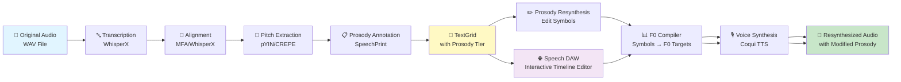
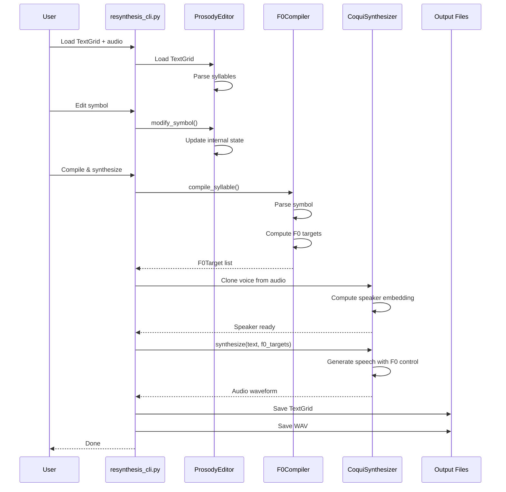
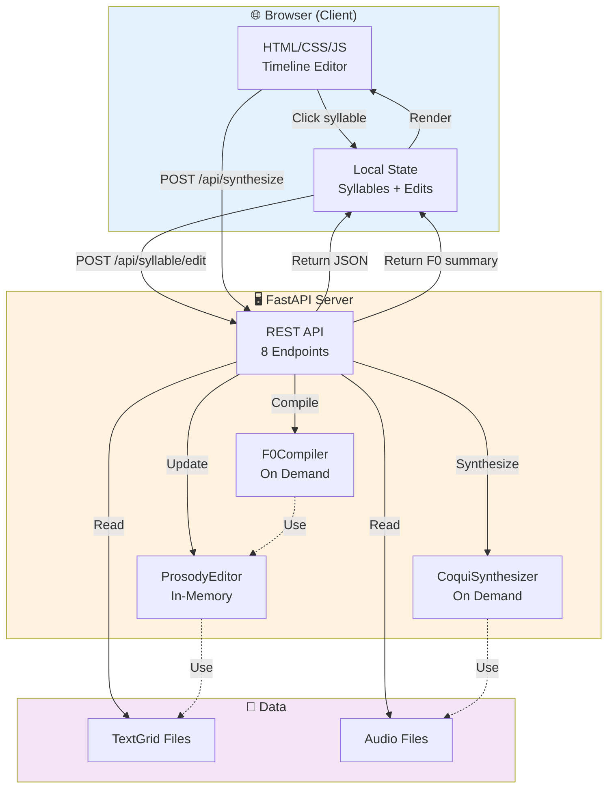
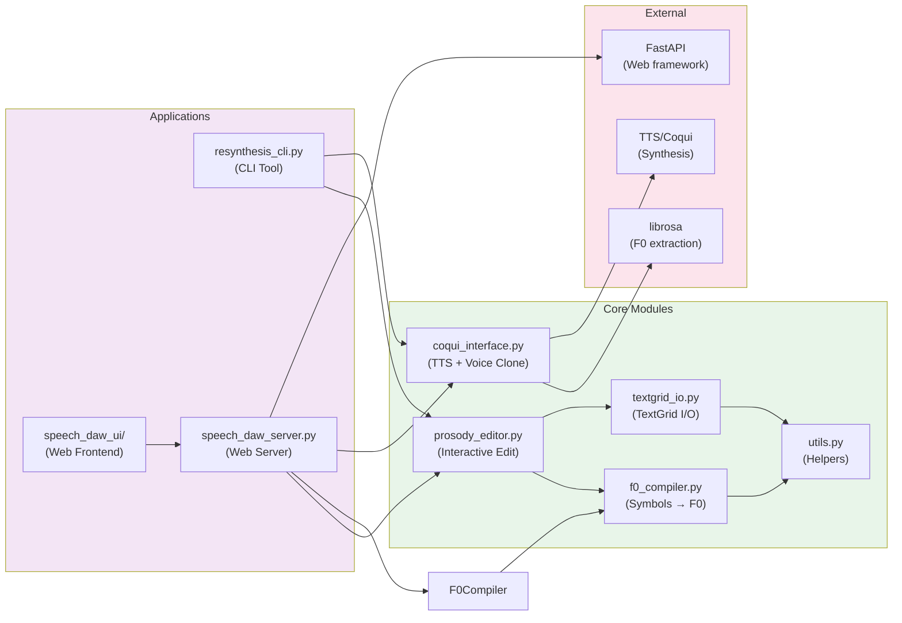
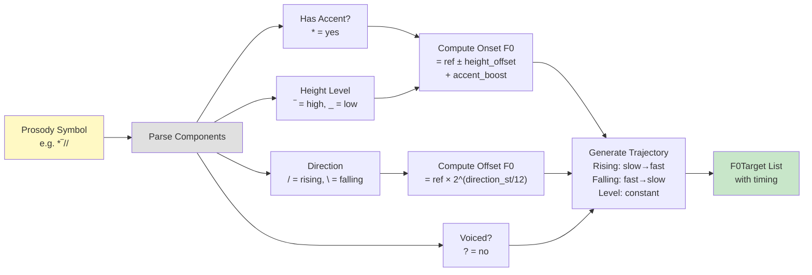
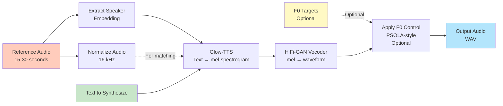
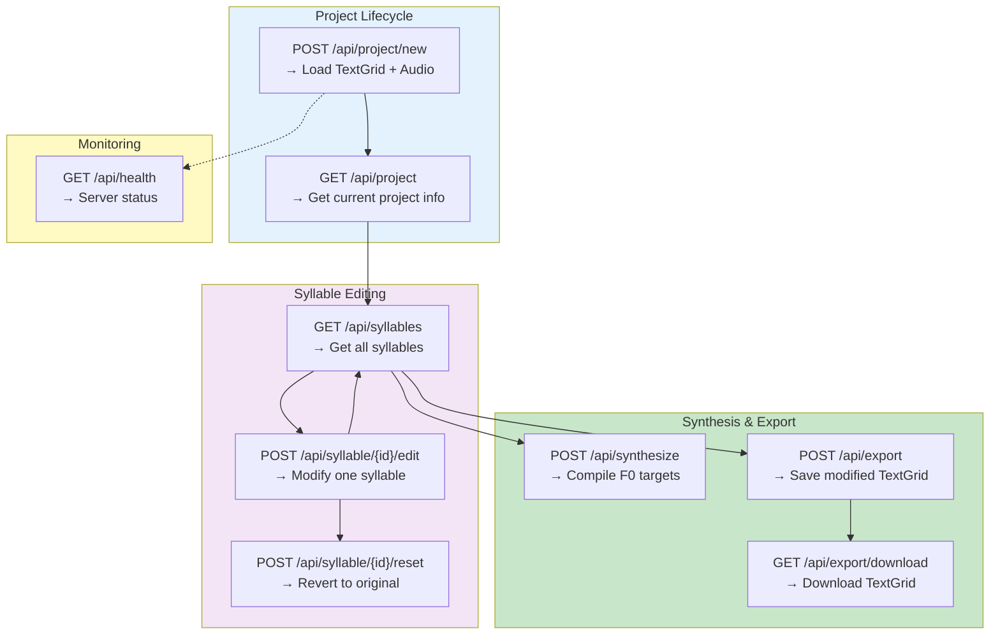
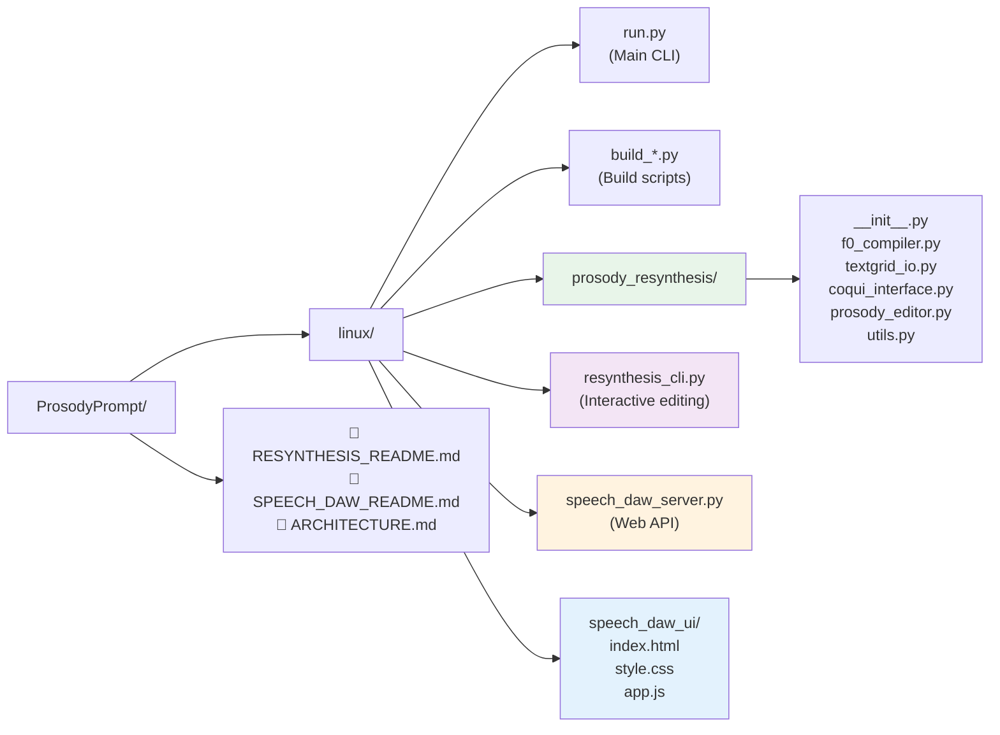

# ProsodyPrompt Architecture & Data Flow

## System Overview

## Detailed Data Flow: Resynthesis Path

## Speech DAW: Web Architecture

## Module Dependencies

## Symbol Compilation Pipeline

## Coqui TTS Synthesis Flow

## REST API Endpoints

## File Organization

## Status Legend

- ✅ **Implemented & Tested**
- ⚠️ **Implemented, Not Fully Tested**
- 🔄 **Partially Implemented**
- 📋 **Design Only**

### Current Status

| Component | Status |
|-----------|--------|
| F0 Compiler | ✅ Works |
| TextGrid I/O | ✅ Works |
| ProsodyEditor | ⚠️ Works with prosody tier |
| Coqui Interface | ⚠️ Wrapper written, TTS not installed |
| Resynthesis CLI | ⚠️ Code complete, end-to-end untested |
| Speech DAW Server | ⚠️ API endpoints work, state management partial |
| Speech DAW UI | ⚠️ HTML/JS complete, not tested in browser |

